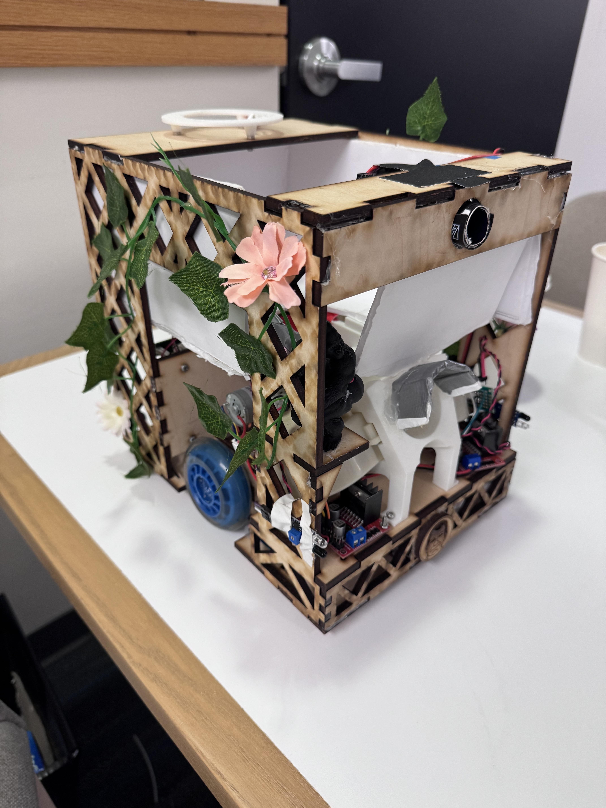

# Autonomous Mechatronics Robot

Team-built autonomous competition robot developed for UCSC ECE 118 Mechatronics.

The robot was designed to orient itself from a randomized starting direction, navigate a tape-marked field, avoid obstacles, locate the opposing robot using a beacon detector, and launch ping-pong balls at the target.

## Demo

[Watch the checkoff/demo video](https://youtube.com/shorts/6KmrB0vmBfA)

## Team Project

This project was completed as a three-person team for ECE 118 Mechatronics at the University of California, Santa Cruz.

The full project combined mechanical design, electrical systems, sensor integration, autonomous navigation, and a ball-launching mechanism.

## My Contributions

My primary contributions focused on embedded software and system integration, including:

- Developing embedded control software in C on the PIC32
- Designing and implementing the event-driven hierarchical state machines
- Implementing orientation, boundary following, obstacle avoidance, target acquisition, and shooting behaviors
- Building tape-sensor and obstacle-detection interfaces using digital I/O and debouncing
- Implementing motor-control interfaces using PWM
- Integrating teammate-written beacon filtering into the control system
- Debugging false sensor detections and hardware/software integration issues

## Software Architecture

The robot used the course Events and Services Framework to implement non-blocking, event-driven behavior.

The top-level hierarchical state machine consisted of three main stages:

1. Find Corner
2. Navigate to Initial Shooting Zone
3. Eliminate Target

The robot used tape sensors for boundary following and obstacle detection, a beacon detector for orientation and target acquisition, and PWM-controlled motors for driving, feeding, and shooting.

## Testing and Debugging

Individual test harnesses were used to verify tape sensors, beacon detection, and motor control before full system integration.

A major challenge was reliable sensor integration. During testing, false positives, missed detections, and repeated sensor events occasionally caused incorrect behavior. Despite these issues, the robot usually completed the field successfully.

## Results

The final robot successfully demonstrated autonomous orientation, field navigation, obstacle avoidance, beacon-based target acquisition, and ball launching.

The project highlighted the difficulty of integrating mechanical, electrical, sensing, and software systems into a reliable autonomous robot.

## Full Project Report

[View the full project report](https://drive.google.com/file/d/1TxgUshEFLkXzg4VonbzkTIoo26xrS6_2/view?usp=sharing)

The report contains the complete mechanical design process, electrical schematics, software architecture, state-machine diagrams, testing results, and project reflection.

## Team

- Perry Chavez
- Michael McBride
- Nivedita Kamath
